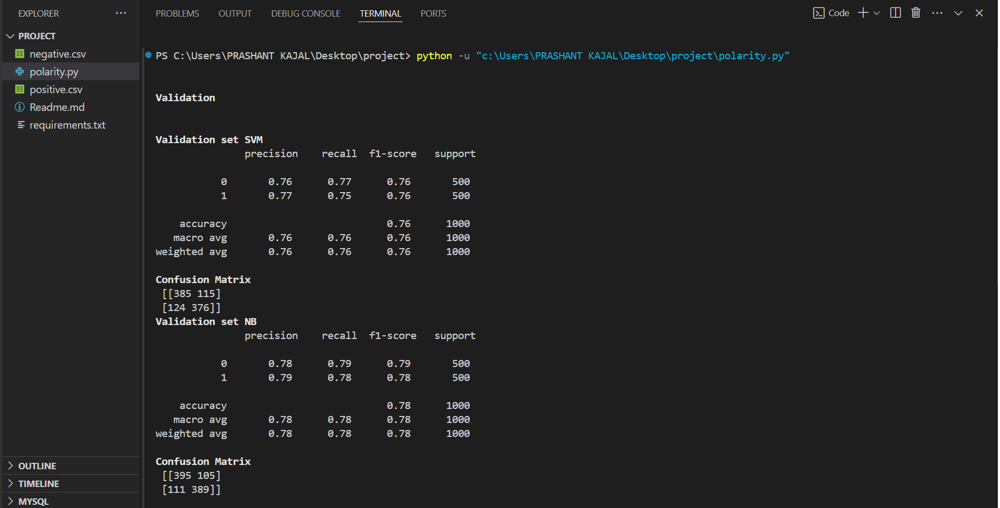
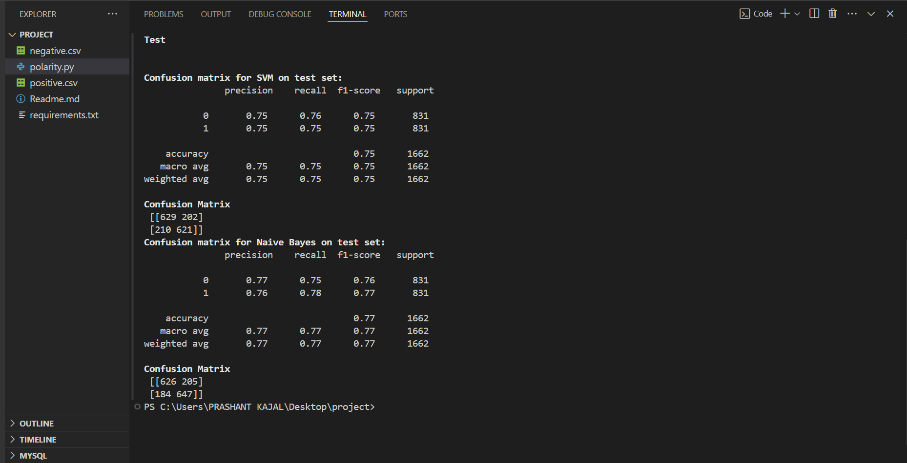

# Sentiment Polarity Classification

This project aims to classify the sentiment polarity (positive or negative) of text using two machine learning models: ***Support Vector Machine (SVM)*** and ***Multinomial Naive Bayes (NB)***. The classification is performed using the Term Frequency-Inverse Document Frequency (TF-IDF) technique for feature extraction from text.

## Project Structure
- positive.csv: File containing positive sentiment texts.
- negative.csv: File containing negative sentiment texts.
- polarity.py The main Python script that loads the dataset, trains the models, and evaluates their performance on validation and test sets.

## Dataset

The dataset consists of two CSV files:
- *positive.csv*: Contains text data labeled as positive.
- *negative.csv*: Contains text data labeled as negative.

Each file is preprocessed by assigning sentiment labels:
- Positive data: Label 1
- Negative data: Label 0

The data is divided into:
- *Training set*: First 4000 samples from both positive and negative data.
- *Validation set*: 500 samples from both positive and negative data.
- *Test set*: Remaining samples from both positive and negative data.

## Project Usage 
```
Clone the Repository
```
```
Navigate to the Project Directory
```
```
Install Dependencies pip install -r requirements.txt
```
```
python -u "<path-to-directory>polarity.py"
```

## Feature Extraction

The *TF-IDF Vectorizer* is used to convert the raw text into numeric features:
- *Sublinear Term Frequency* is enabled.
- Stop words are removed using the English stop words list.

## Models

Two models are trained for classification:
1. *Linear SVM*: A Support Vector Machine model optimized for text classification.
2. *Multinomial Naive Bayes*: A Naive Bayes classifier suited for multi-class text classification.

## Evaluation

Both models are evaluated on the validation and test sets using:
- *Confusion Matrix*: Shows the number of true positive, true negative, false positive, and false negative predictions.
- *Classification Report*: Provides detailed precision, recall, F1-score, and accuracy metrics for each model.

### Validation Results


### Test Results

